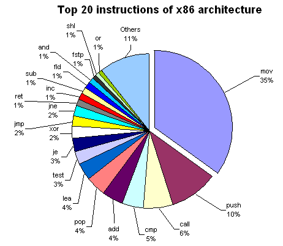
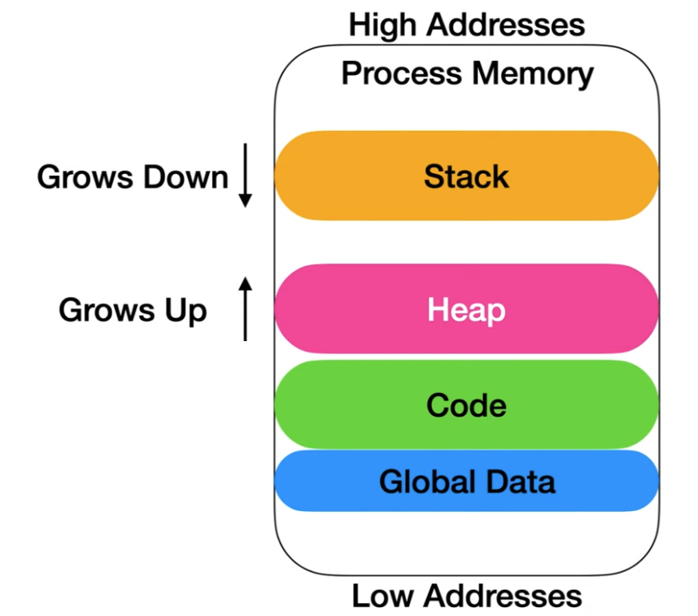
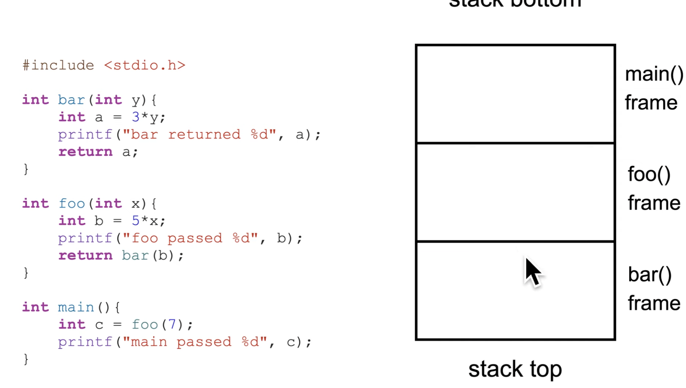
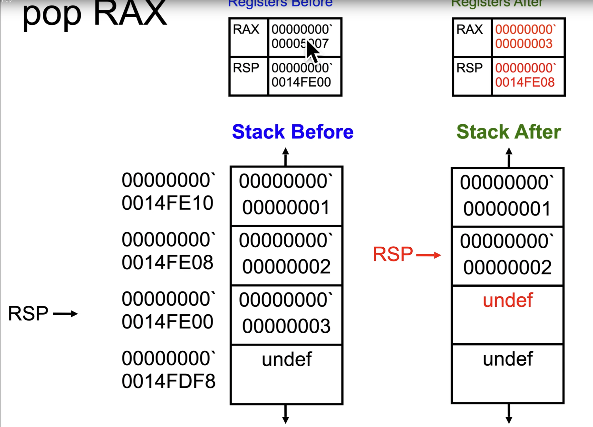
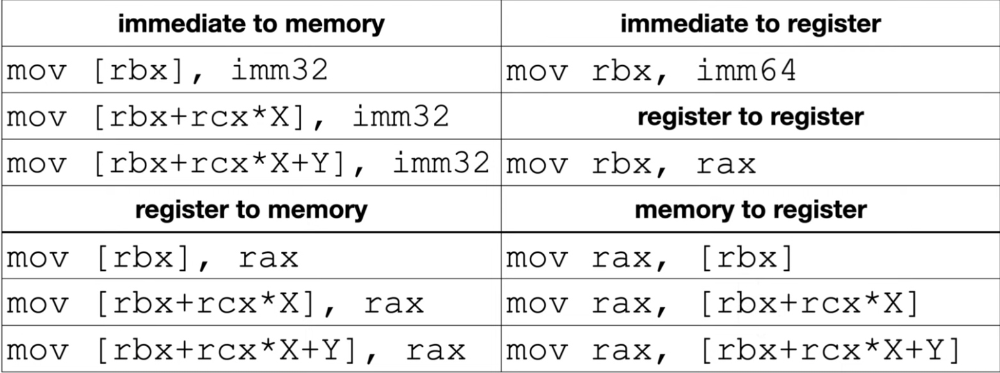

# x86 Leaning Notes

## Learning Source
* https://p.ost2.fyi/courses/course-v1:OpenSecurityTraining2+Arch1001_x86-64_Asm+2021_v1/course/

---

### Memory hierarchy

* As we can see in the picture the processor registers is the fastest but most expensive
  
---

### x86-64 general purpose registers

* Intent has 16 general purpose registers. (2 of them are not general)
* x86-32, registeres are 32 bits wide
* x86-64, registeres are 64 bits wide

---

### Intel recoomended register conventions

* **RAX** : store function return values
* **RBX** : base pointer to the data section
* **RCX** : counter for string and loop operations (usually for looping)
* **RDX** : I/O pointer
* **RSI** : Soruce index pointer for string operation
* **RDI** : Destination index pointer for string operations
* **RSP** : Stack pointer
* **RBP** : Stack frame base pointer
* **RIP** : pointer to next instruction to execute (instruction pointer)
* **NOP** : No operation, align bytes, delay time --> Attacker use it to make simple exploits more reliable

---

### The Stack

* RSP pointer point to the top of the stack
* What info ?
  * return address
* Local variables
* arguments pass between functions
* Dynamically allocated memory
* Save Space for registers
  * share registers
  * when compiler has to deal with many in a function

---

### Push & Pop instructions
* GCC have push pop pair, but other like Visual Studio compiler doesn't have it.
* **push** : when calling such command the RSP (stack pointer) decrement by 8
* \[ ] : brackets means to treate the value within as a memory address, and fetch the value at that address ( get the value of the address inside the bracket)
  * Register --> rbx
  * Memory, base-only --> [rbx]
  * Memory, base + index * scale --> [rbx + rcx * x]
    * FOR x = 1, 2, 4, or 8 
  * Memory, base + index * scale + displacement --> [rbx + rcx * x + y]
* **pop** 
  * 
  * 32bits push/pop : add/remove 32 bits --> RSP +- 4 
  * 64bits push/pop : add/remove 64 bits --> RSP +- 8 

---
## CALL RET MOV ADD SUB

### Syntax

#### Intel
* Syntax Destination <-> Source
* mov rbp, rsp
* add rsp, 0x14 ; (rsp = rsp + 0x14)

#### AT&T
* Syntax Source <-> Destination
* mov %rsp, %rbp
* add $0x14,%rsp
---

* **call** : transfer control to a different function (interrupt)
  * push the addres of the next instruction onto the stack
  * change RIP to the address given in the instruction
    * Destination address
      * absolute address
      * relative address
* **ret** : return from procedure
  * pop the top of the stack into RIP
  * pop the top of the stack into RIP

* **mov** : copy the value 
  * 
  * Register to register
  * memory to register
  * register to memory
  * immediate to register , memory

* **add**/**sub** : add or sub the destination 
  * add rsp, 8 --> (rsp = rsp + 8)
  * sub rax, [rbx*2] --> (rax = rax - (rbx*2))  
--
